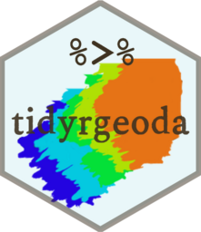

``` r
library(showtext)
showtext_auto(enable = TRUE)
font_add("ShineTypewriter", regular = "./ShineTypewriter-lgwzd.ttf")
library(hexSticker)
library(magick)

sticker(
  subplot = "./geoda_bg.png",
  s_x = 1,
  s_y = .85,
  s_width = .8,
  s_height = .8,
  package = "tidyrgeoda",
  p_family = "ShineTypewriter",
  p_size = 25,
  p_color = ggplot2::alpha("#3e3221",.9),
  p_x = 1,
  p_y = 0.95,
  dpi = 300,
  asp = 1,
  h_size = .75,
  h_color = "#3e3221",
  h_fill = '#e9f7f9',
  white_around_sticker = F,
  filename = "tidyrgeoda_logo.png"
)

image_read('./tidyrgeoda_logo.png') |> 
  image_resize("256x256")|> 
  image_write('./tidyrgeoda_logo.png')

tidyrgeoda_logo = image_read('./tidyrgeoda_logo.png')
pipe = image_read('./pipe.png') |> 
  image_resize("75x45")

image_composite(tidyrgeoda_logo,pipe,
                gravity = "northwest",
                offset = "+75+40") |> 
  image_write('./tidyrgeoda_logo.png')
```



**Thanks to `Cao Yue` for her help on `GeoDa` background image
extraction.**
